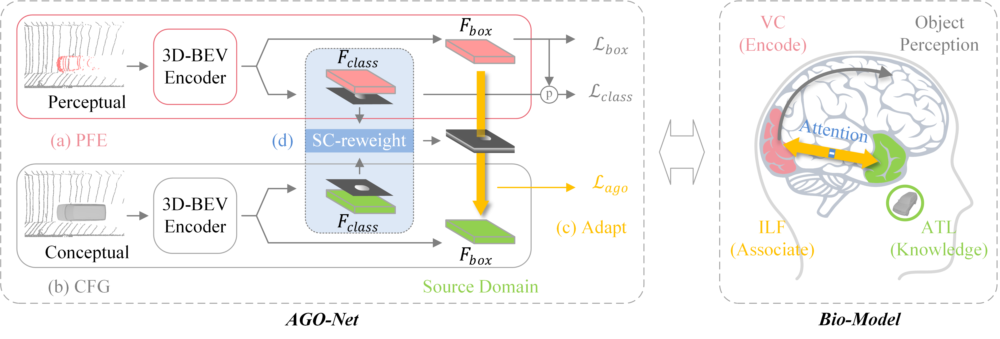

# Associate-3Ddet-V2

Implementation
of [AGO-Net: Association-Guided 3D Point Cloud Object Detection Network](https://ieeexplore.ieee.org/document/9511841),
a paper on pami 2021 (to be updated.)

## Abstract

The human brain can effortlessly recognize and localize objects, whereas current 3D object detection methods based on
LiDAR point clouds still report inferior performance for detecting occluded and distant objects: the point cloud
appearance varies greatly due to occlusion, and has inherent variance in point densities along the distance to sensors.
Therefore, designing feature representations robust to such point clouds is critical. Inspired by human associative
recognition, we propose a novel 3D detection framework that associates intact features for objects via domain
adaptation. We bridge the gap between the perceptual domain, where features are derived from real scenes with
sub-optimal representations, and the conceptual domain, where features are extracted from augmented scenes that consist
of non-occlusion objects with rich detailed information. A feasible method is investigated to construct conceptual
scenes without external datasets. We further introduce an attention-based re-weighting module that adaptively
strengthens the feature adaptation of more informative regions. The network's feature enhancement ability is exploited
without introducing extra cost during inference, which is plug-and-play in various 3D detection frameworks. We achieve
new state-of-the-art performance on the KITTI 3D detection benchmark in both accuracy and speed. Experiments on nuScenes
and Waymo datasets also validate the versatility of our method.




## Requirements

#### Installation

Our code is based on [OpenPCDet](https://github.com/open-mmlab/OpenPCDet), please refer to
the [installation](https://github.com/open-mmlab/OpenPCDet/blob/master/docs/INSTALL.md) for OpenPCDet compilation.

## Data preparation

### NuScenes Dataset
* Please download the official [NuScenes 3D object detection dataset](https://www.nuscenes.org/download) and
  organize the downloaded files as follows:
```
OpenPCDet
├── data
│   ├── nuscenes
│   │   │── v1.0-trainval (or v1.0-mini if you use mini)
│   │   │   │── samples
│   │   │   │── sweeps
│   │   │   │── maps
│   │   │   │── v1.0-trainval  
├── pcdet
├── tools
```

* Install the `nuscenes-devkit` with version `1.0.5` by running the following command:
```shell script
pip install nuscenes-devkit==1.0.5
```

* Generate the data infos by running the following command (it may take several hours):
```python 
python -m pcdet.datasets.nuscenes.nuscenes_dataset --func create_nuscenes_infos \
    --cfg_file tools/cfgs/dataset_configs/nuscenes_dataset.yaml \
    --version v1.0-trainval
```


## Training & Testing

### Train a model

* Train with a single GPU:
```shell script
python train.py --cfg_file ${CONFIG_FILE}
```


### Test and evaluate the pretrained models
* Test with a pretrained model:
```shell script
python test.py --cfg_file ${CONFIG_FILE} --ckpt ${CKPT}
```


## Acknowledgements

We thank [OpenPCDet](https://github.com/open-mmlab/OpenPCDet) for the great works and repos.

## Citation

If you find this project useful in your research, please consider citing:

```
@inproceedings{du2021ago,
  title={AGO-Net: Association-Guided 3D Point Cloud Object Detection Network},
  author={Du, Liang and Ye, Xiaoqing and Tan, Xiao and Johns, Edward and Chen, Bo and Ding, Errui and Xue, Xiangyang and Feng, Jianfeng},
  booktitle={pami},
  year={2021}
}
```

## Contact

For questions regarding AGO-Net, feel free to post here or directly contact the authors (duliang@mail.ustc.edu.cn).
